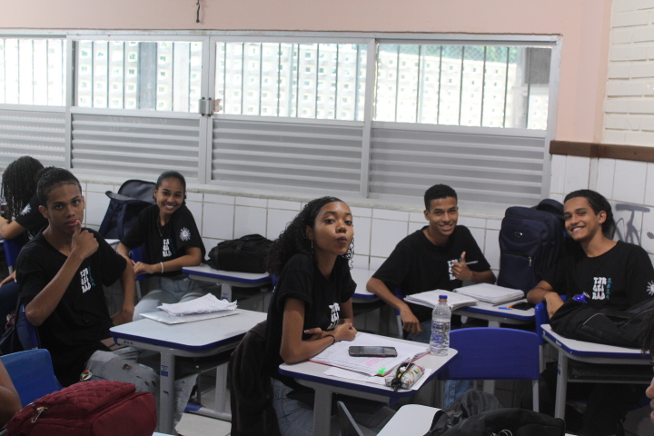

<h1>🏫 Apresentação das Escolas Públicas</h1>

Este projeto documenta a organização e execução de uma apresentação educativa realizada em escolas públicas, focando em diversas áreas de tecnologia e segurança digital.

## 📅 Detalhes da Apresentação

Data da Apresentação: 13 de junho de 2024

Local: Colégio Estadual Raphael Serravale, Salvador, Bahia, Brasil

## 📝 Organização e Preparação

Nicolle, João e Victor Hugo foram os responsáveis pela marcação da apresentação com a escola e pela ajuda na construção das apresentações e detalhes do projeto. Eles trabalharam em estreita colaboração com a administração da escola para garantir que todos os detalhes estivessem em ordem.

Juan ficou responsável pela ajuda na construção das apresentações e pelas fotos, gravação e lista de presença dos alunos da escola participante. Ele garantiu que todos os momentos importantes fossem capturados e documentados para referência futura.

<!-- Caso queira retirar a imagem, só remover a linha abaixo: -->

</img>

## 📚 Apresentações

- **Luis Oliveira**: Ficou responsável pela apresentação sobre fundamentos de Software e Hardware. Ele explicou os conceitos básicos de como os softwares e hardwares funcionam juntos para fazer um computador funcionar.

- **Ramon, Heitor e Arthur**: Ficaram responsáveis pela apresentação de cybersegurança. Eles compartilharam informações valiosas sobre a importância da segurança digital e deram dicas úteis sobre como os alunos podem proteger suas informações online.
- **Guilherme Reis**: Ficou responsável pela apresentação sobre a linguagem Python. Ele introduziu os conceitos básicos da linguagem de programação Python e demonstrou algumas aplicações práticas.

<!-- Caso queira remover o gif, só remover a linha abaixo: -->

## 🤝 Participantes

- **Arthur Amaral Correia de Almeida** - RA: 12724141663

- **Guilherme Reis Correia** - RA: 12722123056
- **Heitor dos Santos Monteiro** - RA: 12724141025
- **João Victor Pinho de Castro** - RA: 1272328040
- **Juan Pablo dos Santos Rodrigues** - RA: 12723131891
- **Luis Claudio de Oliveira Filho** - RA: 12723212051
- **Nicolle Brasil dos Santos Nery** - RA: 12723115108
- **Ramon Queiroz Gonçalves Pinto** - RA: 12724126768
- **Victor Hugo Cordeiro Fucilieri** - RA: 1272123431
